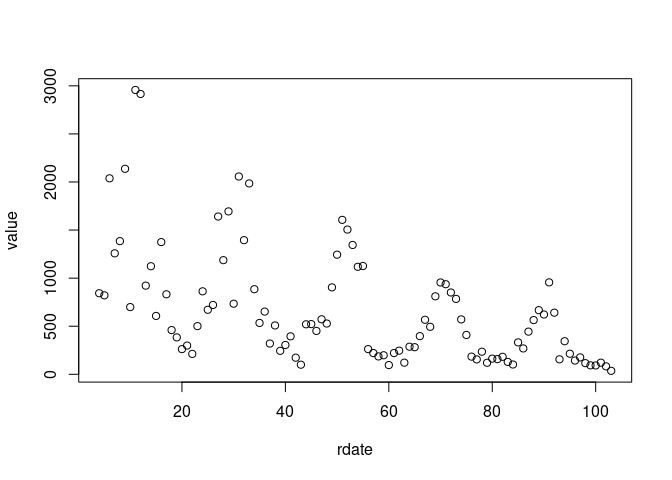
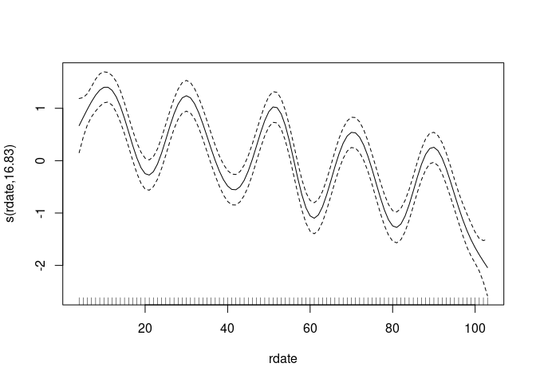
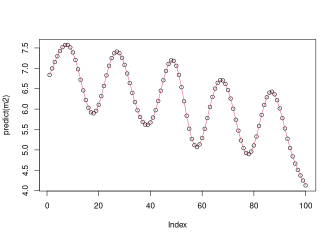
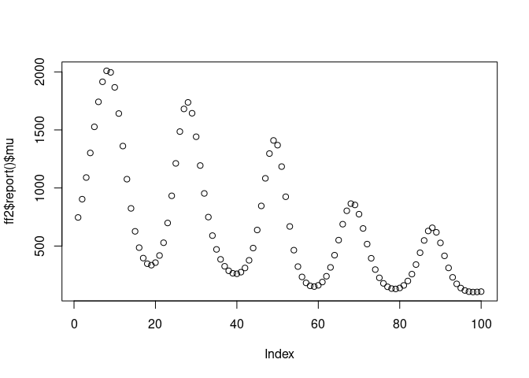
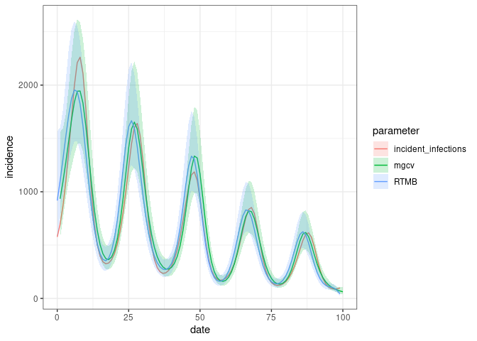
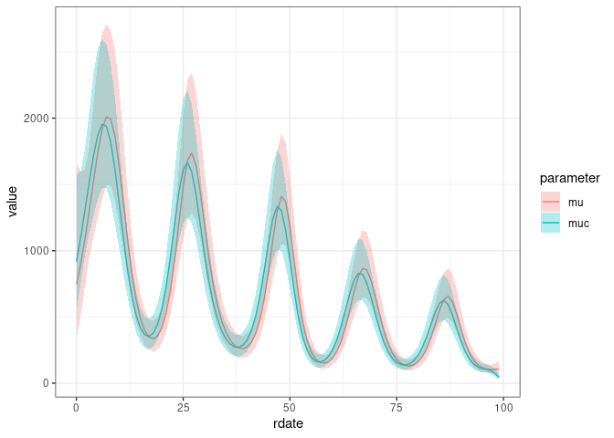
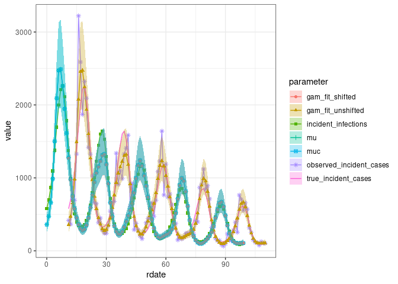
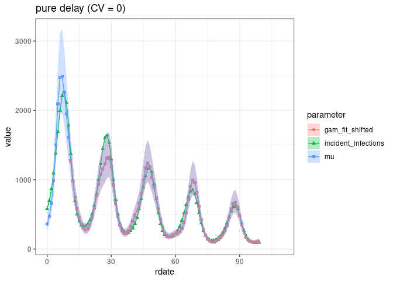
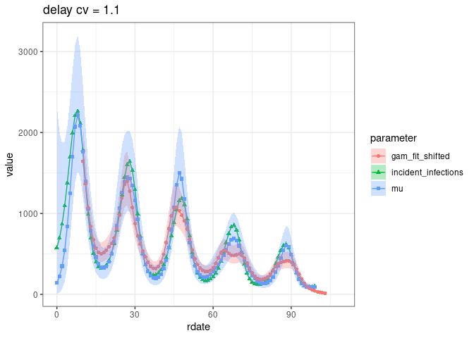
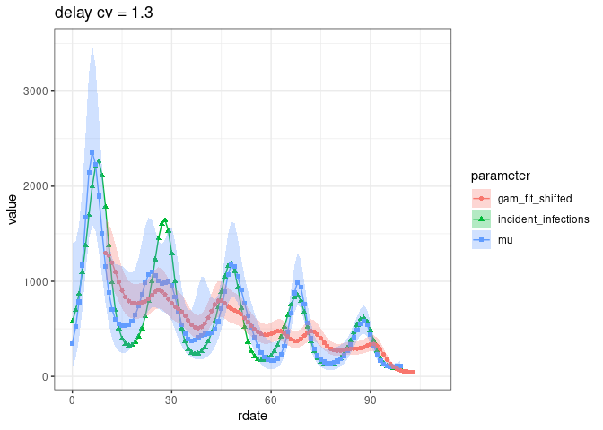

# RTMB-convolution fitting of case reports

2025-06-16

<!--
  html:
    code-fold: true
    code-summary: "Show the code"
    embed-resources: true
        -->

Relevant [GH issue](https://github.com/CDCgov/cfa-gam-rt/issues/88)

Rendered output (GFM) is [here](outputs/convolve.md)

``` r
library(RtGam)
library(dplyr)
library(ggplot2); theme_set(theme_bw())
library(mgcv)
library(glmmTMB)
library(RTMB)
library(broom.mixed) ## for augment etc.
source(here::here("RTMB-convolve","convolve_funs.R"))
```

Use default from `simulate_sir()` for now:

``` r
delay_pmf <- (1:4)/10
delay_mean <- sum(seq_along(delay_pmf)*delay_pmf)
```

Simulate with neg bin etc (accept defaults)

``` r
set.seed(101)
sim0 <- simulate_sir() |>
  mutate(rdate = as.numeric(reference_date - min(reference_date)))
```

Going to focus on estimating true cases (computing Rt seems mildly
tedious and a solved problem …)

``` r
dd <- sim0 |>
  filter(parameter == "observed_incident_cases") |>
  select(date = reference_date, rdate, value)
```

``` r
plot(value ~ rdate, dd)
```



Regular fit (ignore delays) using REML because most (?) reliable for
estimating degree of smoothing bump `k` up from default …

``` r
m1 <- gam(value ~ s(rdate, k = 20), family = "nb", data = dd, method = "REML")
plot(m1)
```



Confirming that glmmTMB can fit the same (unshifted/unconvolved) model:

Have to start glmmTMB with a larger-than-default SD for the spline term
… otherwise collapses (could check profile etc etc). (Default `theta` (=
log-SD for spline term) start value is 0, bump it up to 3 …)

``` r
m2 <- glmmTMB(value ~ s(rdate, k = 20), family = nbinom2, data = dd,
              REML = TRUE, start = list(theta = 3))
```

``` r
plot(predict(m2))
lines(predict(m1), col = 2)
```



(`predict.gam` returns an odd named structure, have to mangle it to
compare)

``` r
stopifnot(all.equal(unname(c(predict(m1))), predict(m2), tolerance = 1e-6))
```

Now use the glmmTMB model structure to fit a model with convolution
instead

### Create TMB-data object

(glmmTMB handles calls to `smoothCon`,
`smooth2random(sm, vnames = "", type = 2)`; might eventually want to
disentangle/extract that code)

This could be done more compactly with `update(..., doFit=FALSE)` but
clearer in this case to let things be self-contained.

``` r
m3 <- glmmTMB(value ~ s(rdate, k = 20), family = nbinom2, data = dd,
              REML = TRUE, start = list(theta = 3), doFit = FALSE)
data.tmb <- c(m3$data.tmb, list(delay_pmf = delay_pmf))
pars0 <- nz_elements(m3$parameters)
```

Base-R, AD versions are identical if no random effects/Laplace approx:

``` r
nll0 <- nll_convolve(pars0)
ff <- MakeADFun(nll_convolve, pars0)
stopifnot(all.equal(ff$fn(), nll0))
## no longer the same if we add LA
ff2 <- MakeADFun(nll_convolve, pars0, random = "b", silent = TRUE)
ff2$fn()
```

    [1] 22030.95
    attr(,"logarithm")
    [1] TRUE

``` r
fit <- with(ff2, nlminb(par, fn, gr))
plot(ff2$report()$mu)
```



Get predictions and CIs

``` r
obs_tvec <- unique(dd$rdate)
pp <- predict(m1, se.fit = TRUE)
mgcv_res <- tibble(parameter = "mgcv",
                   rdate = obs_tvec-delay_mean,
                   value = exp(pp$fit),
                   lwr = exp(pp$fit - 1.96*pp$se.fit),
                   upr = exp(pp$fit + 1.96*pp$se.fit))

RTMB_res <- RTMB::sdreport(ff2) |>
  summary() |>
  as.data.frame() |>
  tibble::rownames_to_column("param") |>
  filter(grepl("^etac", param)) |>
  transmute(
    parameter = "RTMB",
    rdate = 0:99,
    value = Estimate,
    lwr = Estimate - 1.96*`Std. Error`,
    upr = Estimate + 1.96*`Std. Error`) |>
  mutate(across(c(value, lwr, upr), exp))

res1 <- sim0 |>
  filter(parameter == "incident_infections") |>
  bind_rows(RTMB_res, mgcv_res)
```

In this case mean-shifting and convolution do about equally well

``` r
ggplot(res1, aes(rdate, value)) + geom_line(aes(colour = parameter)) +
  geom_ribbon(aes(fill = parameter, ymin = lwr, ymax = upr),
              colour = NA, alpha = 0.2) +
  labs(x = "date", y = "incidence")
```

    Warning in max(ids, na.rm = TRUE): no non-missing arguments to max; returning
    -Inf



``` r
## (warning from NA values in true infections)
```

## Testing encapsulated machinery

``` r
m3 <- fit_RTMB_convolve(value ~ s(rdate, k = 20),
                        family = nbinom2, data = dd,
                        start = list(theta = 3),
                        delay_pmf = delay_pmf)
a3 <- augment(m3)
ggplot(a3, aes(rdate, value, colour = parameter)) +
  geom_line() +
  geom_ribbon(aes(ymin = lwr, ymax = upr, fill = parameter),
              colour = NA, alpha = 0.3)
```



Will want to compare true_rt, true_incident_cases also, maybe, true
growth rate? (maybe adjust code to return true_Rt and
true_rt/true_growth? Back-calculating r from R seems mildly tedious

## Further encapsulation

(Needed to bump up to `k=50`)

``` r
pmf0 <- c(rep(0, 10), 1)
ss <- simfit(delay_pmf = pmf0, seed = 103, k = 50)
## here gam-fit-shifted is indistinguishable from true incident infections
ggfit0 <- ggplot(ss, aes(rdate, value, colour = parameter)) +
  geom_line() + geom_point(aes(shape=parameter)) +
  geom_ribbon(aes(ymin = lwr, ymax = upr, fill = parameter), colour = NA, alpha = 0.3)
print(ggfit0)
```



``` r
incvals <- c("incident_infections", "gam_fit_shifted", "mu")
print(ggfit0 %+% filter(ss, parameter %in% incvals) + labs(title = "pure delay (CV = 0)"))
```



Now a more extreme delay distribution …

``` r
pmf1 <- rep(0.1, 10)
titlefun <- function(pmf) sprintf("delay cv = %1.1f", delay_cv(pmf))
ss1 <- simfit(delay_pmf = pmf1, seed = 103, k = 50)
print(ggfit0 %+% filter(ss1, parameter %in% incvals) + labs(title=titlefun(pmf1)))
```



Even more extreme …

``` r
pmf2 <- c(0.5, rep(0, 8), 0.5)
ss2 <- simfit(delay_pmf = pmf2, seed = 103, k = 50)
## here gam-fit-shifted is indistinguishable from true incident infections
print(ggfit0 %+% filter(ss2, parameter %in% incvals) + labs(title=titlefun(pmf2)))
```



## To do

- is there intuition/math for why taking the convolution into account
- work out how to do stuff with factor/by smooths (whatever RtGam is
  currently using …) – see what breaks (should be transferrable back to
  glmmTMB …)
- will need extra machinery for prediction
- computational cost?
- fragility?
- end effects?
- bam?????
